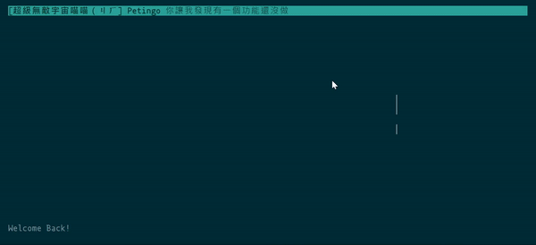

# TeTg
A telegram client on your terminal with optimized experience of TUI!

## Usage
- `s`: Send message to the corresponding chat
- `r`: Reply a message
- `c`: Open chat list, then `enter` to send message

## TODO List:
### Feature
- [ ] Messages sent from "me" to private chat should show the chat title
- [ ] Replied message should be shown in the UI
- [ ] Cache data in local db
- [ ] Optimize Hint

### Refactor
- [ ] In `tui.js`, `sendMsgByRefMsgId`'s first param should be changed

### Bug
- [ ] Bug with emoji, this is a bug in blessed

## About
This app is mainly powered by [airgram](https://github.com/airgram/airgram) and [blessed](https://github.com/chjj/blessed)

## Reference
- TDLib API Doc: https://core.telegram.org/tdlib/docs/td__api_8h.html